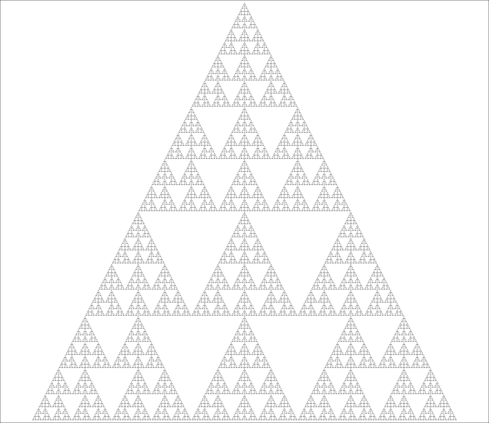
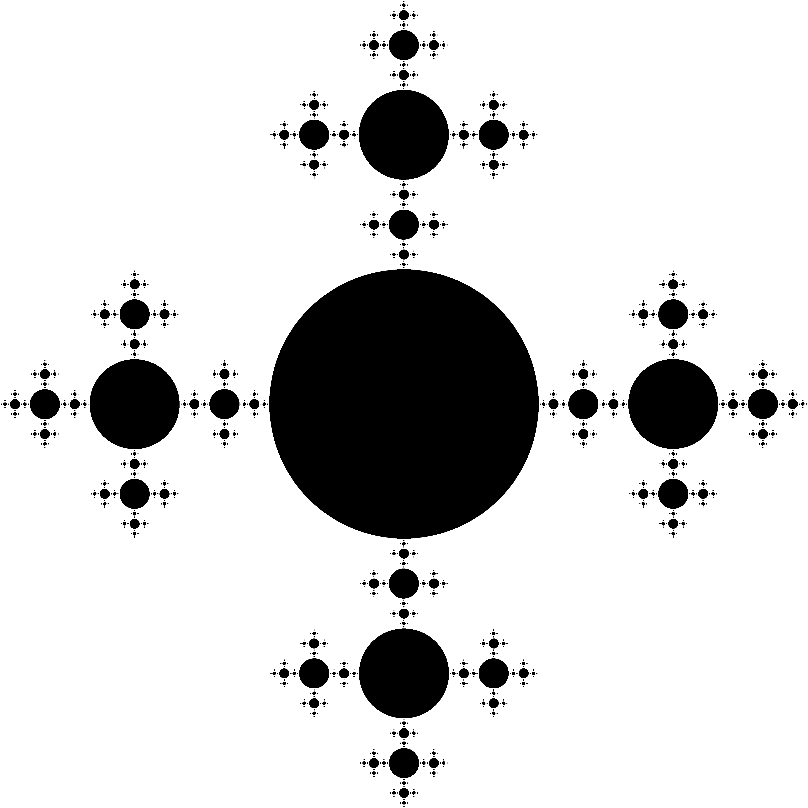

# Fractals
Projeto que reúne alguns algoritmos que geram _fractais_ matemáticos e aleatórios.

___

  
  

  
  

  
  

  
  

  
  

  
  

  
  

  
  

  
  

  
  

  
  

  
  

  
  

  
  

  
  

  
  

  
  

  
  

